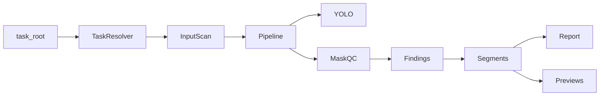

# video_qc_fast

轻量级直播带货抠图**质检识别器**（只做识别与报警，不做修复、不复核、不重跑 SAM2 / MatAnyone）。

## 输入

- `ui_runs/live_commerce/<task_id>`
- 或兼容 `ui_runs/person/<task_id>`

## 输出（写入任务目录下 `qc/`）

- `qc/report.json`
- `qc/report.html`
- `qc/previews/*.jpg`
- `qc/failed_segments.csv`
- `qc/qc_config.yaml`（UI 或 CLI 生成）

## 环境

- **Python 3.10**（与生产 Ubuntu 22.04、MatAnyone 等上游栈一致；不要用 3.11+ 作为默认 venv）
- **生产**：Ubuntu 22.04 + CUDA（推荐）
- **macOS**：Homebrew 安装 3.10 后使用 CPU 或 Apple Silicon MPS

```bash
cd video_qc_fast
# macOS 若未安装 3.10:
# brew install python@3.10
/opt/homebrew/bin/python3.10 -m venv .venv   # Intel Mac 可能是 /usr/local/bin/python3.10
source .venv/bin/activate
pip install -U pip
pip install -r requirements.txt
# Ubuntu + CUDA（按需）:
# pip install torch --index-url https://download.pytorch.org/whl/cu121
```

## 快速使用

```bash
# 仅扫描目录结构
python scripts/scan_task.py /path/to/task --json

# 完整质检
python scripts/run_qc.py /path/to/task --mode sensitive

# Web UI
streamlit run app.py
```

样例数据目录：[`sample_data/`](sample_data/) — 将你的任务文件夹复制进去后再跑上述命令。

## 架构



| 模块 | 说明 |
|------|------|
| `src/resolver.py` | 自动发现 combined_alpha / human_alpha / masks / SAM2 |
| `src/pipeline.py` | 编排采样帧、YOLO、各 QC 阶段、写报告 |
| `src/person_qc.py` | 主播/第二人/多人风险 |
| `src/face_hand_qc.py` | 脸/手 vs combined_alpha |
| `src/product_qc.py` | 商品 mask 面积跳变、手边物体 |
| `src/sam2_qc.py` | SAM2 对象面积/bbox 时序 |
| `src/matanyone_qc.py` | 人像 alpha 掉帧/闪烁 |

## 检测模式

| 模式 | 说明 |
|------|------|
| Conservative | 误报少 |
| Balanced | 默认平衡 |
| Sensitive | 默认推荐，漏报更少 |

配置见 [`config/qc_config.default.yaml`](config/qc_config.default.yaml)。
