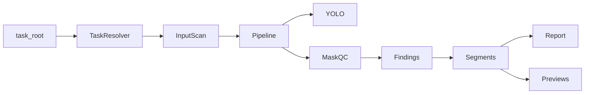

# video_qc_fast

轻量级直播带货抠图**质检识别器**（只做识别与报警，不做修复、不复核、不重跑 SAM2 / MatAnyone）。

## 输入

- `ui_runs/live_commerce/<task_id>`
- 或兼容 `ui_runs/person/<task_id>`

## 输出（写入任务目录下 `qc/`）

- `qc/report.json`
- `qc/report.html`
- `qc/previews/*.jpg`
- `qc/failed_segments.csv`
- `qc/qc_config.yaml`（UI 或 CLI 生成）

## 环境

- **Python 3.10**（与生产 Ubuntu 22.04、MatAnyone 等上游栈一致；不要用 3.11+ 作为默认 venv）
- **生产**：Ubuntu 22.04 + CUDA（推荐）
- **macOS**：Homebrew 安装 3.10 后使用 CPU 或 Apple Silicon MPS

```bash
cd video_qc_fast
# macOS 若未安装 3.10:
# brew install python@3.10
/opt/homebrew/bin/python3.10 -m venv .venv   # Intel Mac 可能是 /usr/local/bin/python3.10
source .venv/bin/activate
pip install -U pip
pip install -r requirements.txt
# Ubuntu + CUDA（按需）:
# pip install torch --index-url https://download.pytorch.org/whl/cu121
```

## 快速使用

```bash
# 仅扫描目录结构
python scripts/scan_task.py /path/to/task --json

# 完整质检：默认 yolo_frame_policy=all，优先保证召回
python scripts/run_qc.py /path/to/task --mode sensitive

# 快速粗筛：只在 mask 面积突变点和基准帧跑 YOLO，速度更快但可能漏掉部分 YOLO-only 告警
python scripts/run_qc.py /path/to/task --mode sensitive --yolo-frame-policy smart

# Web UI
streamlit run app.py
```

样例数据目录：[`sample_data/`](sample_data/) — 将你的任务文件夹复制进去后再跑上述命令。

Smart 快速粗筛报告示例：[`docs/examples/smart_report.html`](docs/examples/smart_report.html)。

## 报告阅读

运行后会在任务目录下写入：

- `qc/report.html`：人工复核入口，包含异常时间轴、复核重点、失败片段预览和中文说明。
- `qc/report.json`：结构化结果，适合后续系统读取。
- `qc/failed_segments.csv`：失败片段表。
- `qc/previews/*.jpg`：带框/轮廓的复核图。

`report.html` 顶部会优先展示：

- **异常时间轴**：问题集中出现在哪些时间点。
- **复核重点**：时间码、帧号范围、峰值帧、质量问题中文解释。
- **失败片段卡片**：预览图、复核建议、证据字段（如面积、覆盖率、SAM2 对象名）。

`report.json` 的 `performance.stage_seconds` 会记录阶段耗时：

```json
{
  "setup": 0.71,
  "mask_io": 9.04,
  "yolo": 11.41,
  "sam2": 1.77,
  "preview": 0.52,
  "report": 0.01
}
```

CLI 也会打印这些信息，方便判断下一步该优化 YOLO、mask I/O、SAM2 还是预览。

## 架构



| 模块 | 说明 |
|------|------|
| `src/resolver.py` | 自动发现 combined_alpha / human_alpha / masks / SAM2 |
| `src/pipeline.py` | 编排采样帧、YOLO、各 QC 阶段、写报告 |
| `src/person_qc.py` | 主播/第二人/多人风险 |
| `src/face_hand_qc.py` | 脸/手 vs combined_alpha |
| `src/product_qc.py` | 商品 mask 面积跳变、手边物体 |
| `src/sam2_qc.py` | SAM2 对象面积/bbox 时序 |
| `src/matanyone_qc.py` | 人像 alpha 掉帧/闪烁 |

## 检测模式

| 模式 | 说明 |
|------|------|
| Conservative | 误报少 |
| Balanced | 默认平衡 |
| Sensitive | 默认推荐，漏报更少 |

## YOLO 选帧策略

| 策略 | 命令 / 配置 | 适用场景 |
|------|-------------|----------|
| `all` | 默认；`--yolo-frame-policy all` | 完整质检，优先保证召回。每个采样帧都跑 YOLO seg + pose。 |
| `smart` | `--yolo-frame-policy smart` | 快速粗筛。只对 mask 面积突变点附近和固定基准帧跑 YOLO。更快，但可能漏掉部分依赖 YOLO 姿态/物体检测的告警。 |

Smart 报告效果预览：[`docs/examples/smart_report.html`](docs/examples/smart_report.html)。

相关配置在 [`config/qc_config.default.yaml`](config/qc_config.default.yaml)：

```yaml
runtime:
  yolo_frame_policy: "all"       # all | smart
  yolo_baseline_seconds: 2.0     # smart: 每 N 秒至少跑一次 YOLO
  yolo_mask_change_ratio: 0.35   # smart: mask 面积变化超过该比例时选入候选
  yolo_candidate_window: 1       # smart: 候选点前后各扩 N 个采样帧
```

推荐上线流程：

1. 批量任务先用 `smart` 做快速粗筛，找出明显异常任务。
2. 对 `smart` 报警任务、边界任务或最终交付前任务，再跑默认 `all` 完整质检。
3. 若希望 `smart` 更稳，可以降低 `yolo_baseline_seconds` 或增大 `yolo_candidate_window`，代价是速度下降。

配置见 [`config/qc_config.default.yaml`](config/qc_config.default.yaml)。
